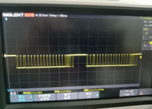
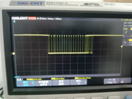
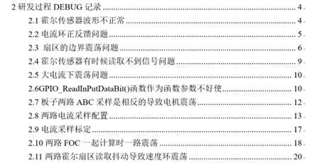
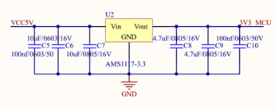
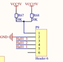
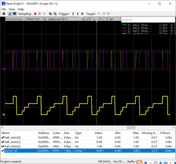
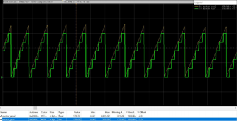
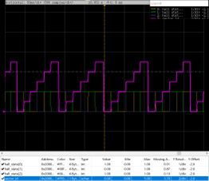
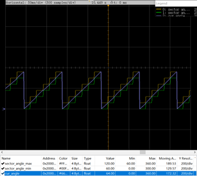

# 硬件组新手教程

*Written by 于佳强*

*At 2021.10*

对于刚来硬件组的队员们，你们一开始的任务肯定是看着一个不是自己画的硬件电路焊接板子。尤其是对于一些之前没有焊接经验的同学，更是一种折磨。大家们本来课余时间就少，结果在焊台焊接板子、校验电路，几个小时就没有了，多少会心生厌恶。但是请记住，焊接和校验只是一个做硬件的人的基本功。出现问题不要慌，我在下面分享一下我的经验。

1. 关于焊接技巧，一方面要成员之间多交流，尽快和新老队员们建立强大的联系，分享踩过的坑和经验。
2. 多看网上的视频资料，比如哔哩哔哩视频，上面真的有太多的视频啦。比如焊接视频，电路板布板视频。
3. 学会使用身边和工具。万用表每个人都要熟练的使用，他可以测量短路、断路、二极管正负导通、电阻、电压等。尤其是要熟练使用短路档位。对于刚接触焊接的同学们，不可避免出现虚焊的问题，虚焊的地方往往用肉眼看比较困难，这时候我们就要用短路档位判断电路图硬件连接的地方你是否焊接上了。要是焊接上了，你测试的两个点就是短路状态，万用表就会响。
4. 电路图上之前的人会画一些LED灯，这些其实就是重要的指示灯。我们经常要依靠指示灯来判断电路板是否处于正常的工作状态。电源指示灯、呼吸灯之类的。大家可以依靠电源指示灯来判断该LED灯网络所处在的电压是否正常，判断短路和断路问题。
5. 必要时使用示波器，示波器对于没用过的同学比较难上手，但是它可以判断很多问题，尤其是通信的时序问题，判断其CAN 通信、串口通信是否正常，判断定时器脉冲是否正常、判断斩波是否正常。
6. 
7. CAN通信过程的正常波形，测量CAN_H和CAN_L
8. 
9. 正常CAN通信的波形，测量STM32芯片的CAN_TX和GND。如果测量芯片的引脚都没有输出波形，说明底层配置不对。如果芯片引脚有波形而CAN总线上没有波形，则说明是CAN模块硬件损坏（CAN芯片坏了）。
10. 学会做维修日志。维修日志记录着你每天的进展、你每天遇到的问题、你解决问题的方法。当然也可以是一堆目前无法解决的问题的集锦。做好日志可以让你日后少踩坑，也可以互相分享、大家一起共同进步。  话不多说，我就上图了：
11. 
12. 这是一个维修日志的目录
13. 节选片段：
14. 

## 霍尔传感器有时候读取不到信号问题

图 霍尔传感器的5V供电来源

图 霍尔传感器接线

用J-LINK供电，有时候读取不到霍尔传感器信号。

问题解决：给24V供电或者5V供电后读取正常

原因：J-LINK输出电压是3.3V，有概率通转压给霍尔传感器反向供电，所以有时候能够接到数据，有时候不行。和板子的接触不良没有关系，这里犯了事后归因的错误。

## 霍尔传感器波形不正常

图 霍尔传感器波形异常

图 正常的波形

换了程序也不好使

图 发现MCU的PE1引脚虚焊（悬空），补上焊锡后好使。推测是形成了电容，导致相位滞后。

图 总之目前霍尔信号读取好使了。

当然还有许多技巧没有在上面，大家可以一起分享，留下书面语言，便于交流。
