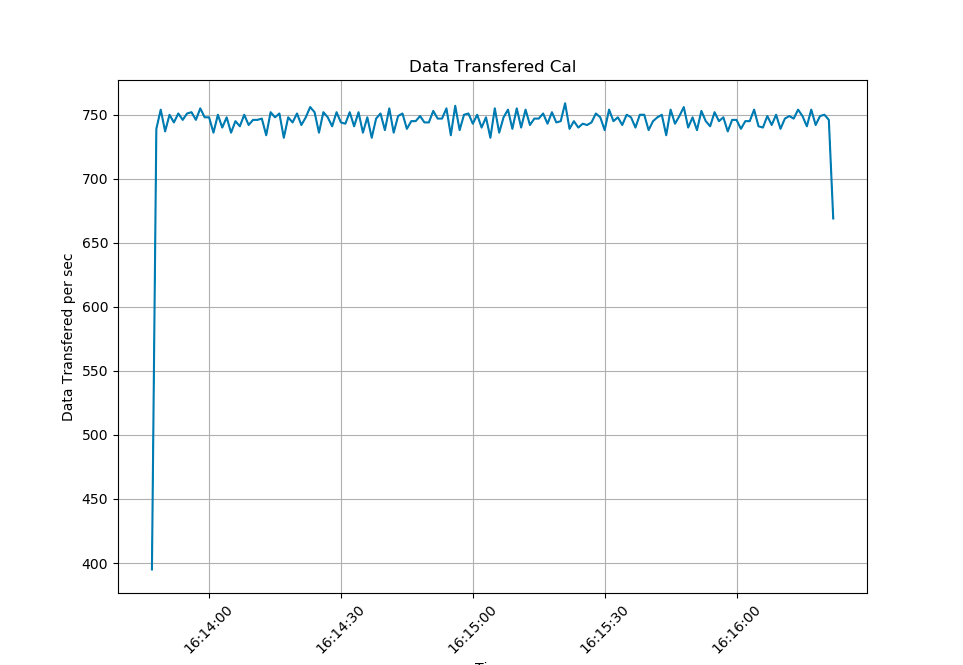

### 绘制CAN总线数据帧率曲线
使用**正常整车数据准备灯亮空档有驻车.txt**的数据，计算每秒钟接收到的CAN消息数量

计算结果是现在的总线的CAN的帧率在750帧/s


### 负载率计算过程
DLC8个字节的标准帧bit数
```
以dlc为8个字节的标准帧为例，帧起始(1bit)+仲裁场(11bit)+控制场(6)+数据场(64bit)+CRC场(16bit)+[ACK场](2bit)+帧结束(7bit)+ITM(3bit) = 111bit
```
CAN通信现在是: 250k的Baudrate
那么是: 
250k bit/s

250k/111 = 2.25k Frame/s

所以计算负载率大约为 750/2.25k = 33.3%


### 之前用过的一个例子(参考):

CAN通信是: 1M的Baudrate
那么是: 
1000k bit/s

1000k/111 = 9.01k Frame/s

所以挂8个1k帧率的电机

### Code
```Python
import pandas as pd

import matplotlib.pyplot as plt

plt.rcParams['font.family'] = 'SimHei' # 设置使用的中文字体，比如SimHei

  

# 读取文本文件

data = pd.read_csv('/home/tipriest/Documents/calCANRate/data.txt', delimiter='\t', encoding='gbk')

  

# 处理时间列

data['时间标识'] = pd.to_datetime(data['时间标识'], errors='coerce') # 将无效的时间值转换为NaT

data = data.dropna(subset=['时间标识']) # 删除包含空时间值的行

data = data.set_index('时间标识')

  

# 计算每秒传输的数据个数

data['每秒传输数据个数'] = data.resample('S')['数据'].count()

  

# 绘制每秒传输数据个数随时间的变化图

plt.plot(data.index.values, data['每秒传输数据个数'].values)

plt.xlabel('Time')

plt.ylabel('Data Transfered per sec')

plt.title('Data Transfered Cal')

plt.xticks(rotation=45)

plt.grid(True)

plt.show()
```