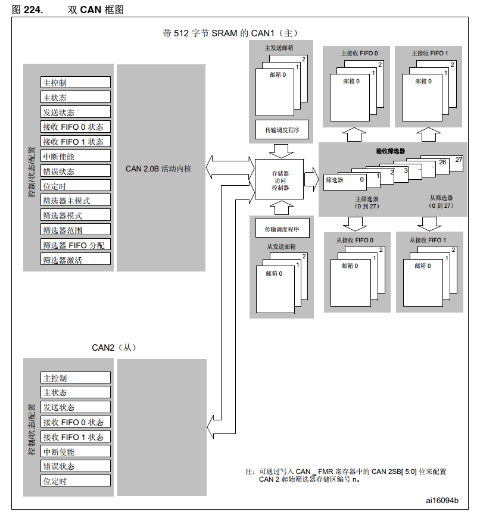
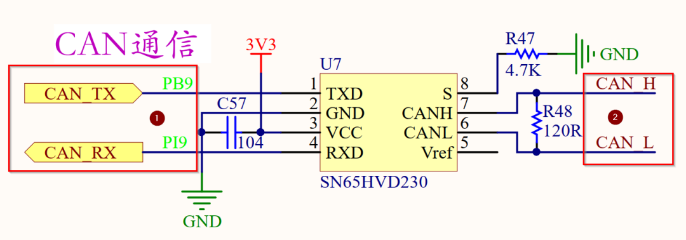

# 又踩坑了！这次败给CAN总线了

文章来源于**小麦大叔公众号** ，作者**菜刀和小麦**

## 前言

最近负责的一个项目用的主控芯片是 `STM32F407IGT6`，需要和几个电机控制器进行通讯，有很多参数需要进行监控。
有一个问题一直无法解决。在开启 `CAN`的接收中断，接收不到数据，问题卡了很久，下面简单分享一下解决的过程和思路。

## 目录

* 背景
* CAN总线
* CAN控制器
* CAN收发器
* 调试过程
  * 硬件排查
  * CAN分析仪
  * 芯片CAN控制器调试
* 总结

## CAN总线

CAN总线是一种串行通信协议，用于在微控制器和其他设备之间传输数据。CAN总线通常用于汽车、工业自动化和机器人等领域。

CAN总线的硬件通常由以下几个部分组成：

* 控制器区域：包括CAN控制器和CAN收发器；
* 总线电缆：用于连接CAN总线上的所有设备；
* 终端电阻：用于终止总线，以减少反射和信号干扰；
* 外部电源：用于为CAN总线提供电源；

CAN总线的控制器区域通常包括 **CAN控制器** 和 **CAN收发器** 。

* **CAN控制器**负责处理CAN总线上的数据传输，包括数据发送和接收、错误检测和纠正等；
* **CAN收发器**则负责将CAN控制器的信号转换为总线上的电信号，并将总线上的电信号转换为CAN控制器可以理解的信号。

## CAN控制器

主板上的芯片 `STM32F407IGT6`中带有两路的 **CAN控制器** ，分别为 `CAN1` 和 `CAN2`，具体如下图所示；



## CAN收发器

主板上使用的是芯片 `SN65HVD230`，这是TI公司的一款性能强大且具体低功耗功能的 **CAN收发器** ，具体的典型应用电路如下所示；


## 调试过程

### 硬件排查

设备的调试过程中，首先要确保硬件链路上是否正常。最常见的方法就是直接用示波器进行检查。具体如下所示；



1. 检查CAN控制器和CAN收发器之间是否正常；
2. 检查CAN收发器的差分信号是否正常，这里可能要了解一下CAN总线电平的显性电平和隐性电平的特点，以及CAN底层协议的细节，会比较复杂；

个人比较推荐使用上述步骤检查硬件链路是否存在问题，那如何对数据进行分析呢？当然可以对着示波器的波形一点一点进行分析，但是这样是很低效的，这里我建议使用CAN分析仪进行数据抓包，下面我们继续进行介绍。

### CAN分析仪

至于数据传输是否正确，可以使用CAN盒进行数据监听，下面是我使用的一款CAN分析仪，如图；


将CAN分析仪的 `CAN_H`和 `CAN_L`分别并联到CAN收发器的 `CAN_H`和 `CAN_L`上，然后打开CAN分析仪厂家提供的PC软件，就可以对CAN总线的数据进行监听；

1. 将CAN分析仪接入到CAN总线；
2. 将CAN分析仪连接到电脑（这里是USB接口），需要配置相同的波特率；
3. 打开CAN分析仪配套的PC软件，进行数据的收发；

   
4. 进行到这里，我在项目中遇到的问题是，发送正常，但是 `STM32F407`无法接收到连续的数据，可以接收到一次数据，后面便无法再进入中断。这时候，只能在芯片端进行 `Debug`了。

### 芯片CAN控制器调试

这里的代码用的HAL库，库版本相对来说比较老，是 `V1.7.10`版本的，如下图所示；


当时我把项目升级到最新的HAL库，发现CAN部分的驱动改动比较大，另外，下文都是基于 `V1.7.10`版本的HAL库。

CAN控制器的初始化代码如下所示；


```

void MX_CAN_Init(void)
{
 CAN_FilterConfTypeDef  sFilterConfig;

 /*CAN单元初始化*/
 hCAN.Instance = CANx;             /* CAN外设 */
 hCAN.pTxMsg = &TxMessage;
 hCAN.pRxMsg = &RxMessage;

 hCAN.Init.Prescaler = 6;          /* BTR-BRP 波特率分频器  定义了时间单元的时间长度 42/(1+6+7)/6 = 500Kbps */
 hCAN.Init.Mode = CAN_MODE_NORMAL; /* 正常工作模式 */
 hCAN.Init.SJW = CAN_SJW_1TQ;      /* BTR-SJW 重新同步跳跃宽度 1个时间单元 */
 hCAN.Init.BS1 = CAN_BS1_6TQ;      /* BTR-TS1 时间段1 占用了6个时间单元 */
 hCAN.Init.BS2 = CAN_BS2_7TQ;      /* BTR-TS1 时间段2 占用了7个时间单元 */
 hCAN.Init.TTCM = DISABLE;         /* MCR-TTCM  关闭时间触发通信模式使能 */
 hCAN.Init.ABOM = ENABLE;          /* MCR-ABOM  自动离线管理 */
 hCAN.Init.AWUM = ENABLE;          /* MCR-AWUM  使用自动唤醒模式 */
 hCAN.Init.NART = DISABLE;         /* MCR-NART  禁止报文自动重传   DISABLE-自动重传 */
 hCAN.Init.RFLM = DISABLE;         /* MCR-RFLM  接收FIFO 锁定模式  DISABLE-溢出时新报文会覆盖原有报文 */
 hCAN.Init.TXFP = DISABLE;         /* MCR-TXFP  发送FIFO优先级 DISABLE-优先级取决于报文标示符 */
 HAL_CAN_Init(&hCAN);

 /*CAN过滤器初始化*/
 sFilterConfig.FilterNumber = 0;                    /* 过滤器组0 */
 sFilterConfig.FilterMode = CAN_FILTERMODE_IDMASK;  /* 工作在标识符屏蔽位模式 */
 sFilterConfig.FilterScale = CAN_FILTERSCALE_32BIT; /* 过滤器位宽为单个32位。*/
 /* 使能报文标示符过滤器按照标示符的内容进行比对过滤，扩展ID不是如下的就抛弃掉，是的话，会存入FIFO0。 */
 sFilterConfig.FilterIdHigh         = 0x0000; //(((uint32_t)0x1314<<3)&0xFFFF0000)>>16;    /* 要过滤的ID高位 */
 sFilterConfig.FilterIdLow          = 0x0000; //(((uint32_t)0x1314<<3)|CAN_ID_EXT|CAN_RTR_DATA)&0xFFFF; /* 要过滤的ID低位 */
 sFilterConfig.FilterMaskIdHigh     = 0x0000;   /* 过滤器高16位每位必须匹配 */
 sFilterConfig.FilterMaskIdLow      = 0x0000;   /* 过滤器低16位每位必须匹配 */
 sFilterConfig.FilterFIFOAssignment = 0;           /* 过滤器被关联到FIFO 0 */
 sFilterConfig.FilterActivation = ENABLE;          /* 使能过滤器 */ 
 sFilterConfig.BankNumber = 14;
 HAL_CAN_ConfigFilter(&hCAN, &sFilterConfig);
  
}
```


根据注释，可以大概看懂，另外再简单分析一下关键的几点；

* 波特率设置为 500Kbps；
* 对报文不进行过滤，可以接收任何扩展ID的数据；

虽然不进行任何过滤，但是还是无法接收到CAN回传的数据，无法进入到接收中断；

从STM32F407的编程手册里了解到；


不难发现，`CAN1`的 `FIFO0`产生接收中断需要满足三个条件中的任意一个；

* `FMPIE0`置 `1` 且 `FMP0`置 `1`；**FIFO不为空会产生中断**
* `FFIE0`置 `1` 且 `FULL`置 `1`；**FIFO满，会产生中断**
* `FOVIE0`置 `1` 且 `FOVR0`置 `1`；**FIFO溢出，会产生中断**

手册里是这样描述的，如下图所示；


使用仿真器对芯片进行调试，设置断点，发现 `FMPIE0`被清空了，具体如下图所示；

`FMPIE0`这一位是FIFO0中有挂起的消息会产生中断的中断使能标志位；


所以到这里，问题有点明朗了，**为什么无法进入中断？是中断使能位被清空了。**

那么下面就是检查代码，看看是哪里把中断给 `disable`了。

继续调试，发现在 `ESR`寄存器中，`TEC`的值一直增加，然后 `EWGF`被值 `1`了；具体如下所示；


`TEC`和 `REC`分别是发送错误计数器和接收错误计数器；

> 如 CAN 协议所述，错误管理完全由硬件通过发送错误计数器（ CAN_ESR 寄存器中的 TEC 值）和接收错误计数器（ CAN_ESR 寄存器中的 REC 值）来处理，这两个计数器根据错误 状况进行递增或递减。有关 TEC 和 REC 管理的详细信息，请参见 CAN 标准。两者均可由软件读取，用以确定网络的稳定性。此外， CAN 硬件还将在 CAN_ESR 寄存器中 提供当前错误状态的详细信息。通过 CAN_IER 寄存器（ ERRIE 位等），软件可以非常灵活 地配置在检测到错误时生成的中断。

当 `TEC`大于**96**的时候，硬件会将 `EWGF`置 `1`（错误警告标志位）；在代码中找到了相应的宏定义；这下问题越来越清晰了。


全文搜索这个宏定义，在 `HAL_CAN_IRQHandler`中找到了 `__HAL_CAN_DISABLE_IT(CAN_IT_FMP0)`，关闭了 `FIFO0`的消息挂起中断， 整体代码如下；

```
/**
  * @brief  Handles CAN interrupt request  
  * @param  hcan: pointer to a CAN_HandleTypeDef structure that contains
  *         the configuration information for the specified CAN.
  * @retval None
  */
void HAL_CAN_IRQHandler(CAN_HandleTypeDef* hcan)
{
  uint32_t tmp1 = 0U, tmp2 = 0U, tmp3 = 0U;
  uint32_t errorcode = HAL_CAN_ERROR_NONE;

  /* Check Overrun flag for FIFO0 */
  tmp1 = __HAL_CAN_GET_FLAG(hcan, CAN_FLAG_FOV0);
  tmp2 = __HAL_CAN_GET_IT_SOURCE(hcan, CAN_IT_FOV0);
  if(tmp1 && tmp2)
  {
    /* Set CAN error code to FOV0 error */
    errorcode |= HAL_CAN_ERROR_FOV0;

    /* Clear FIFO0 Overrun Flag */
    __HAL_CAN_CLEAR_FLAG(hcan, CAN_FLAG_FOV0);
  }
  /* Check Overrun flag for FIFO1 */
  tmp1 = __HAL_CAN_GET_FLAG(hcan, CAN_FLAG_FOV1);
  tmp2 = __HAL_CAN_GET_IT_SOURCE(hcan, CAN_IT_FOV1);

  if(tmp1 && tmp2)
  {
    /* Set CAN error code to FOV1 error */
    errorcode |= HAL_CAN_ERROR_FOV1;

    /* Clear FIFO1 Overrun Flag */
    __HAL_CAN_CLEAR_FLAG(hcan, CAN_FLAG_FOV1);
  }

  /* Check End of transmission flag */
  if(__HAL_CAN_GET_IT_SOURCE(hcan, CAN_IT_TME))
  {
    tmp1 = __HAL_CAN_TRANSMIT_STATUS(hcan, CAN_TXMAILBOX_0);
    tmp2 = __HAL_CAN_TRANSMIT_STATUS(hcan, CAN_TXMAILBOX_1);
    tmp3 = __HAL_CAN_TRANSMIT_STATUS(hcan, CAN_TXMAILBOX_2);
    if(tmp1 || tmp2 || tmp3)  
    {
      tmp1 = __HAL_CAN_GET_FLAG(hcan, CAN_FLAG_TXOK0);
      tmp2 = __HAL_CAN_GET_FLAG(hcan, CAN_FLAG_TXOK1);
      tmp3 = __HAL_CAN_GET_FLAG(hcan, CAN_FLAG_TXOK2);
      /* Check Transmit success */
      if(tmp1 || tmp2 || tmp3)
      {
        /* Call transmit function */
        CAN_Transmit_IT(hcan);
      }
      else /* Transmit failure */
      {
        /* Set CAN error code to TXFAIL error */
        errorcode |= HAL_CAN_ERROR_TXFAIL;
      }

      /* Clear transmission status flags (RQCPx and TXOKx) */
      SET_BIT(hcan->Instance->TSR, CAN_TSR_RQCP0  | CAN_TSR_RQCP1  | CAN_TSR_RQCP2 | \
                                   CAN_FLAG_TXOK0 | CAN_FLAG_TXOK1 | CAN_FLAG_TXOK2);
    }
  }

  tmp1 = __HAL_CAN_MSG_PENDING(hcan, CAN_FIFO0);
  tmp2 = __HAL_CAN_GET_IT_SOURCE(hcan, CAN_IT_FMP0);
  /* Check End of reception flag for FIFO0 */
  if((tmp1 != 0U) && tmp2)
  {
    /* Call receive function */
    CAN_Receive_IT(hcan, CAN_FIFO0);
  }

  tmp1 = __HAL_CAN_MSG_PENDING(hcan, CAN_FIFO1);
  tmp2 = __HAL_CAN_GET_IT_SOURCE(hcan, CAN_IT_FMP1);
  /* Check End of reception flag for FIFO1 */
  if((tmp1 != 0U) && tmp2)
  {
    /* Call receive function */
    CAN_Receive_IT(hcan, CAN_FIFO1);
  }

  /* Set error code in handle */
  hcan->ErrorCode |= errorcode;

  tmp1 = __HAL_CAN_GET_FLAG(hcan, CAN_FLAG_EWG);
  tmp2 = __HAL_CAN_GET_IT_SOURCE(hcan, CAN_IT_EWG);
  tmp3 = __HAL_CAN_GET_IT_SOURCE(hcan, CAN_IT_ERR);
  /* Check Error Warning Flag */
  if(tmp1 && tmp2 && tmp3)
  {
    /* Set CAN error code to EWG error */
    hcan->ErrorCode |= HAL_CAN_ERROR_EWG;
  }
  
  tmp1 = __HAL_CAN_GET_FLAG(hcan, CAN_FLAG_EPV);
  tmp2 = __HAL_CAN_GET_IT_SOURCE(hcan, CAN_IT_EPV);
  tmp3 = __HAL_CAN_GET_IT_SOURCE(hcan, CAN_IT_ERR); 
  /* Check Error Passive Flag */
  if(tmp1 && tmp2 && tmp3)
  {
    /* Set CAN error code to EPV error */
    hcan->ErrorCode |= HAL_CAN_ERROR_EPV;
  }
  
  tmp1 = __HAL_CAN_GET_FLAG(hcan, CAN_FLAG_BOF);
  tmp2 = __HAL_CAN_GET_IT_SOURCE(hcan, CAN_IT_BOF);
  tmp3 = __HAL_CAN_GET_IT_SOURCE(hcan, CAN_IT_ERR);  
  /* Check Bus-Off Flag */
  if(tmp1 && tmp2 && tmp3)
  {
    /* Set CAN error code to BOF error */
    hcan->ErrorCode |= HAL_CAN_ERROR_BOF;
  }
  
  tmp1 = HAL_IS_BIT_CLR(hcan->Instance->ESR, CAN_ESR_LEC);
  tmp2 = __HAL_CAN_GET_IT_SOURCE(hcan, CAN_IT_LEC);
  tmp3 = __HAL_CAN_GET_IT_SOURCE(hcan, CAN_IT_ERR);
  /* Check Last error code Flag */
  if((!tmp1) && tmp2 && tmp3)
  {
    tmp1 = (hcan->Instance->ESR) & CAN_ESR_LEC;
    switch(tmp1)
    {
      case(CAN_ESR_LEC_0):
          /* Set CAN error code to STF error */
          hcan->ErrorCode |= HAL_CAN_ERROR_STF;
          break;
      case(CAN_ESR_LEC_1):
          /* Set CAN error code to FOR error */
          hcan->ErrorCode |= HAL_CAN_ERROR_FOR;
          break;
      case(CAN_ESR_LEC_1 | CAN_ESR_LEC_0):
          /* Set CAN error code to ACK error */
          hcan->ErrorCode |= HAL_CAN_ERROR_ACK;
          break;
      case(CAN_ESR_LEC_2):
          /* Set CAN error code to BR error */
          hcan->ErrorCode |= HAL_CAN_ERROR_BR;
          break;
      case(CAN_ESR_LEC_2 | CAN_ESR_LEC_0):
          /* Set CAN error code to BD error */
          hcan->ErrorCode |= HAL_CAN_ERROR_BD;
          break;
      case(CAN_ESR_LEC_2 | CAN_ESR_LEC_1):
          /* Set CAN error code to CRC error */
          hcan->ErrorCode |= HAL_CAN_ERROR_CRC;
          break;
      default:
          break;
    }

    /* Clear Last error code Flag */ 
    hcan->Instance->ESR &= ~(CAN_ESR_LEC);
  }
  
  /* Call the Error call Back in case of Errors */
  if(hcan->ErrorCode != HAL_CAN_ERROR_NONE)
  {
    /* Clear ERRI Flag */ 
    hcan->Instance->MSR = CAN_MSR_ERRI; 
    /* Set the CAN state ready to be able to start again the process */
    hcan->State = HAL_CAN_STATE_READY;

    /* Disable interrupts: */
    /*  - Disable Error warning Interrupt */
    /*  - Disable Error passive Interrupt */
    /*  - Disable Bus-off Interrupt */
    /*  - Disable Last error code Interrupt */
    /*  - Disable Error Interrupt */
    /*  - Disable FIFO 0 message pending Interrupt */
    /*  - Disable FIFO 0 Overrun Interrupt */
    /*  - Disable FIFO 1 message pending Interrupt */
    /*  - Disable FIFO 1 Overrun Interrupt */
    /*  - Disable Transmit mailbox empty Interrupt */
    __HAL_CAN_DISABLE_IT(hcan, CAN_IT_EWG |
                               CAN_IT_EPV |
                               CAN_IT_BOF |
                               CAN_IT_LEC |
                               CAN_IT_ERR |
                               CAN_IT_FMP0|
                               CAN_IT_FOV0|
                               CAN_IT_FMP1|
                               CAN_IT_FOV1|
                               CAN_IT_TME);

    /* Call Error callback function */
    HAL_CAN_ErrorCallback(hcan);
  }  
}
```

最后，找到无法进入接收中断的原因，是CAN总线出现**发送错误**的情况，从而触发了**错误警告标志位** `EWGF`，进而将关闭了消息挂起中断。

## 总结

本文简单介绍了在STM32F407上的CAN总线调试过程，项目中难免会遇到各种问题，解决之后，大家要及时做好总结和复盘，技术在于积累和沉淀，相互学习，共同进步。
