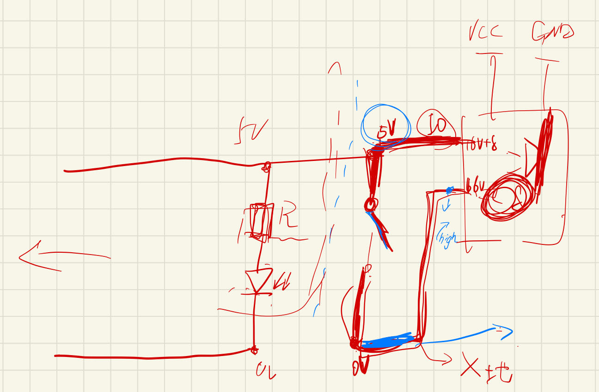
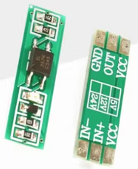

### 1.隔离与安全
### 2.使用前提
> 光耦的使用前提是信号的高电平情况具有一定的输出能力，至少也要有1-5mA的输出能力，否则光耦无法进行应用
### 3.调试案例
> 有过一个惨痛的教训，下面的电路，右边的设备有一个开关，在开关没有被按下的时候，上下之间的压差是4.8V，亮红灯，在开关被按下的时候，上下之间的压差是0V，亮黄灯
> 

> 需求是能够采样上下压差进行判断，准备使用光耦方案，通过上下之间的5V的压差来作为光耦的输入端的输入信号
> 实际也购买了光耦进行测试，光耦的型号如下图所示:
> 

> 进行了如下调试：
>
> 
> 1.  光耦的回路中串接了一个470欧姆的电阻，将光耦接入到5V信号的两端，发现上下之间的压差被拉到2.8V，亮黄灯，更改开关状态NPN管开闭正常
>
> 2.  更改回路中串接的电阻为2.5k欧姆，将光耦接入到5V信号的两端，发现上下之间的压差被拉到3.8V，亮黄灯，更改开关状态NPN管开闭异常
> 
> 3.  更改回路中串接的电阻为5k欧姆，将光耦接入到5V信号的两端，发现上下之间的压差被拉到4.6V，亮红灯，更改开关状态NPN管开闭异常
> 
> 这表明光耦干扰了信号，表明信号的输出能力很差，无法带动光耦，所以5V一定不是功率，推测为单片机内部的5V上拉IO，该IO通过采样自己是否为低电平，判断开关是否被按下
> 
> 那有什么解决方案呢？
> 目前想到的解决方案有三种，
>1.  在开关上侧进行外部上拉，提高该IO的输出能力，再使用光耦进行信号采样
>2.  使用运放对信号进行采集，采用运放输出信号来驱动光耦进行信号采集 
>3.  直接将自己使用的采样的单片机的地与开关的下端共起来，通过输入模式采样采样开关上端
>
> 该经验教训的一些反思：
> 
> 1. 怎么样能够判断输出能力是否够用呢？ 这个哪怕现在我站在事后的角度也无法进行判断，那该怎么进行判断呢？
> 2. 运放的输出能力够不够点光耦的呢，应该是够的，那能点几个呢，光耦正常的电流是多少mA，运放的输出电流又是多少mA?
> 3. 专业的工程师是不是应该有这个运放+光耦的采样板啊

